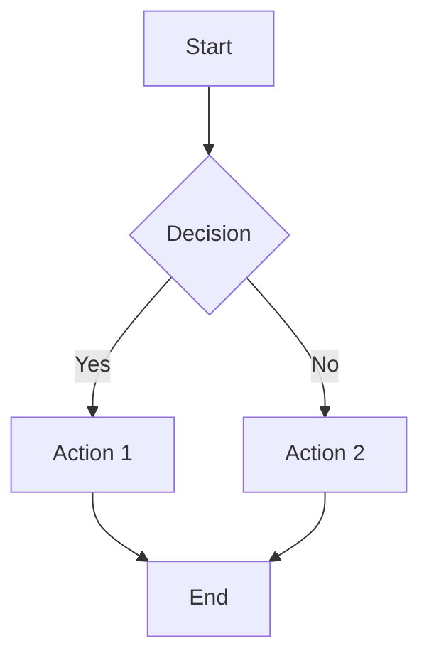

# CodeDefender Documentation Guide

This document describes the documentation structure and guidelines for the CodeDefender project.

## Documentation Structure

The documentation is organized as follows:

```
docs/
├── index.md                           # Main documentation entry point
├── overview.md                        # System overview
├── overview/                          # High-level architecture and design
│   ├── architecture.md                # System architecture
│   ├── security-model.md              # Security and authorization model
│   ├── data-model.md                  # Database and data models
│   ├── code-organization.md           # Code structure and organization
│   ├── api-design.md                  # API design principles
│   ├── authentication.md              # Authentication system
│   ├── authorization.md               # Authorization system
│   └── testing-strategy.md            # Testing approach
├── developing/                        # Developer guides
│   ├── coding-standards.md            # Coding guidelines
│   ├── contributing.md                # Contribution guidelines
│   └── adding-new-features.md         # Guide for adding features
├── authorization/                     # Authorization system details
│   ├── README.md                      # Authorization overview
│   ├── core-concepts.md               # Core authorization concepts
│   ├── permissions.md                 # Permissions reference
│   ├── guards-decorators.md           # Guards and decorator usage
│   └── guides/                        # Authorization guides
│       ├── adding-permissions.md      # Adding new permissions
│       ├── securing-endpoints.md      # Securing API endpoints
│       ├── working-with-plans.md      # Plan-based features
│       └── implementing-limits.md     # Usage limits implementation
├── api/                               # API documentation
│   ├── README.md                      # API overview
│   ├── authentication.md              # Authentication API
│   └── scans.md                       # Scans API
├── database/                          # Database documentation
│   ├── schema.md                      # Database schema
│   ├── migrations.md                  # Database migrations
│   └── seeding.md                     # Database seeding
├── development/                       # Development setup
│   ├── setup.md                       # Environment setup
│   ├── coding-guidelines.md           # Coding guidelines
│   └── testing.md                     # Testing guidelines
└── plans/                             # Subscription plans
    ├── README.md                      # Plans overview
    └── using-plan-based-access.md     # Using plans for feature access
```

## Documentation Guidelines

### General Principles

1. **Keep Documentation Updated**: Documentation should be treated as code and kept in sync with implementation changes.
2. **Clear and Concise**: Write in a clear, concise manner that is accessible to developers of all experience levels.
3. **Code Examples**: Include relevant code examples for complex concepts.
4. **Diagrams**: Use diagrams (Mermaid or other formats) to explain complex systems or flows.
5. **Consistency**: Maintain consistent formatting, style, and terminology throughout the documentation.

### Markdown Formatting

- Use Markdown headings (`#`, `##`, `###`) for section hierarchy
- Use code blocks with language specification for code examples
- Use bullet points and numbered lists for clarity
- Use tables for structured data
- Use blockquotes for important notes or warnings

Example:

```markdown
# Heading 1

## Heading 2

### Heading 3

This is a paragraph with **bold** and *italic* text.

- Bullet point 1
- Bullet point 2
  - Nested bullet point

1. Numbered item 1
2. Numbered item 2

| Column 1 | Column 2 |
|----------|----------|
| Value 1  | Value 2  |

> **Note**: This is an important note.

```typescript
// Code example with syntax highlighting
function example(): void {
  console.log('This is an example');
}
```
```

### Documentation Types

#### Overview Documents

- Provide high-level understanding of the system
- Explain architectural decisions and patterns
- Include diagrams for visual representation
- Focus on "why" more than "how"

#### Reference Documents

- Provide comprehensive, detailed information
- Document all available options and parameters
- Organize content for easy reference
- Include examples for common use cases

#### How-To Guides

- Provide step-by-step instructions for specific tasks
- Focus on practical application
- Include real-world examples
- Address common issues and their solutions

#### Tutorials

- Guide readers through a complete process from start to finish
- Assume minimal prior knowledge
- Build knowledge incrementally
- Include explanations of concepts as they are introduced

### Maintaining Documentation

#### When to Update Documentation

- When adding new features
- When changing existing functionality
- When fixing bugs that affect documented behavior
- When deprecating features

#### Documentation Review Process

- Documentation changes should be reviewed along with code changes
- Verify technical accuracy
- Check for clarity and completeness
- Ensure consistent style and formatting

## Documentation Tools

### Mermaid Diagrams

Use Mermaid for creating diagrams directly in Markdown:



### JSDoc Comments

Use JSDoc-style comments for code documentation:

```typescript
/**
 * Validates user permissions against a list of required permissions
 * 
 * @param userId - The ID of the user to check
 * @param permissions - Array of permission codes to check
 * @param workspaceId - Optional workspace context
 * @returns True if user has all required permissions
 */
function validatePermissions(
  userId: string, 
  permissions: string[], 
  workspaceId?: string
): Promise<boolean> {
  // Implementation
}
```

## Document Generation

For API documentation, we use Swagger/OpenAPI through NestJS's Swagger module. This generates interactive API documentation automatically from code annotations.

Example controller with Swagger annotations:

```typescript
@ApiTags('users')
@Controller('users')
@ApiBearerAuth()
export class UsersController {
  @Post()
  @ApiOperation({ summary: 'Create a new user' })
  @ApiResponse({ status: 201, description: 'User created successfully' })
  @ApiResponse({ status: 400, description: 'Invalid input' })
  create(@Body() createUserDto: CreateUserDto) {
    // Implementation
  }
}
```