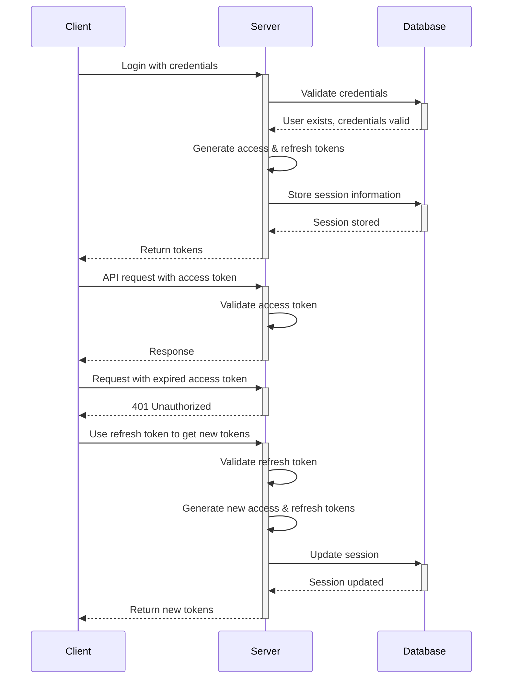

# Authentication System

CodeDefender implements a modern, secure authentication system with multiple authentication methods and comprehensive session management.

## Authentication Flow

### JWT-Based Authentication



## Authentication Methods

### Username/Password
- Standard email/password authentication
- Password hashing with bcrypt
- Password complexity requirements
- Account lockout after failed attempts

### OAuth Providers
- GitHub OAuth integration
- GitLab OAuth integration
- Provider identity linking

### Passwordless Authentication
- Magic link authentication via email
- Time-limited tokens
- Single-use tokens

## Session Management

### Session Model
```typescript
model Session {
  id                String            @id @default(uuid())
  userId            String            @map("user_id")
  token             String            @unique // JWT ID
  ipAddress         String?           @map("ip_address")
  userAgent         String?           @map("user_agent")
  deviceFingerprint String?           @map("device_fingerprint")
  lastActive        DateTime          @default(now()) @map("last_active")
  expiresAt         DateTime          @map("expires_at")
  isRevoked         Boolean           @default(false) @map("is_revoked")
  
  user              User              @relation(fields: [userId], references: [id], onDelete: Cascade)
}
```

### Session Features
- **Multi-device support**: Users can be logged in on multiple devices
- **Session listing**: Users can view all active sessions
- **Session revocation**: Users can revoke sessions on other devices
- **Automatic expiry**: Sessions expire based on configurable timeouts
- **Inactivity timeout**: Sessions are invalidated after periods of inactivity

## Multi-Factor Authentication

### TOTP-Based MFA
- Time-based one-time password (TOTP) implementation
- Compatible with standard authenticator apps
- Backup codes for account recovery

### Trusted Devices
```typescript
model TrustedDevice {
  id                String            @id @default(uuid())
  userId            String            @map("user_id")
  fingerprint       String
  name              String?
  ipAddress         String?           @map("ip_address")
  lastUsed          DateTime          @default(now()) @map("last_used")
  
  user              User              @relation(fields: [userId], references: [id], onDelete: Cascade)
}
```

## Token Management

### Access Tokens
- Short-lived JWTs (15 minutes)
- Contains user identity and permissions
- Used for API authorization

### Refresh Tokens
- Long-lived tokens (30 days)
- Stored securely in HTTP-only cookies
- Used to obtain new access tokens

### Token Service
```typescript
@Injectable()
export class TokensService {
  constructor(
    private jwtService: JwtService,
    private configService: ConfigService,
    private prisma: PrismaService,
  ) {}

  async generateTokens(userId: string, deviceInfo?: DeviceInfo): Promise<TokenPair> {
    // Generate access and refresh tokens
  }

  async refreshTokens(refreshToken: string): Promise<TokenPair> {
    // Validate refresh token and generate new tokens
  }

  async revokeSession(sessionId: string): Promise<void> {
    // Revoke a specific session
  }

  async revokeAllSessions(userId: string, exceptSessionId?: string): Promise<void> {
    // Revoke all sessions for a user
  }
}
```

## Security Features

### Device Fingerprinting
- Browser and device fingerprinting
- Suspicious login detection
- Geographic location tracking

### Rate Limiting
- Login attempt rate limiting
- IP-based throttling
- Account-based throttling

### Automated Protections
- Suspicious location alerts
- Account takeover prevention
- Brute force protection

## Integration Points

### API Authentication
All API endpoints are protected using the `JwtAuthGuard`:

```typescript
@Injectable()
export class JwtAuthGuard extends AuthGuard('jwt') {
  constructor(private reflector: Reflector) {
    super();
  }

  canActivate(context: ExecutionContext) {
    // JWT validation logic
  }
}
```

### Audit Logging
Authentication events are logged in the audit system:

```typescript
@Injectable()
export class AuthService {
  constructor(
    private prisma: PrismaService,
    private tokensService: TokensService,
    private auditLogService: AuditLogService,
  ) {}

  async login(loginDto: LoginDto, deviceInfo: DeviceInfo): Promise<AuthResponse> {
    // Authentication logic
    await this.auditLogService.log({
      userId: user.id,
      action: 'LOGIN',
      details: {
        method: 'password',
        ipAddress: deviceInfo.ipAddress,
        userAgent: deviceInfo.userAgent,
      },
    });
  }
}
```