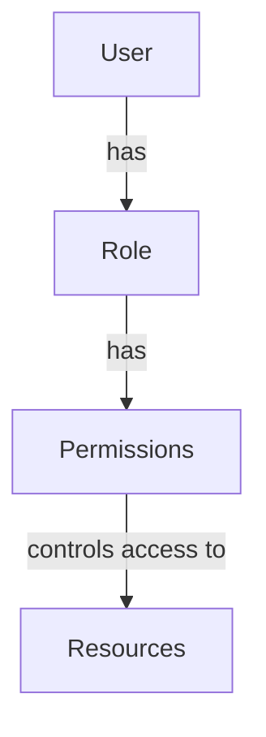
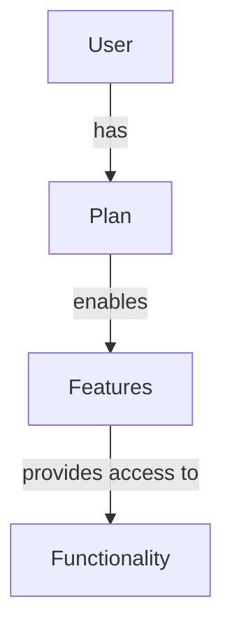
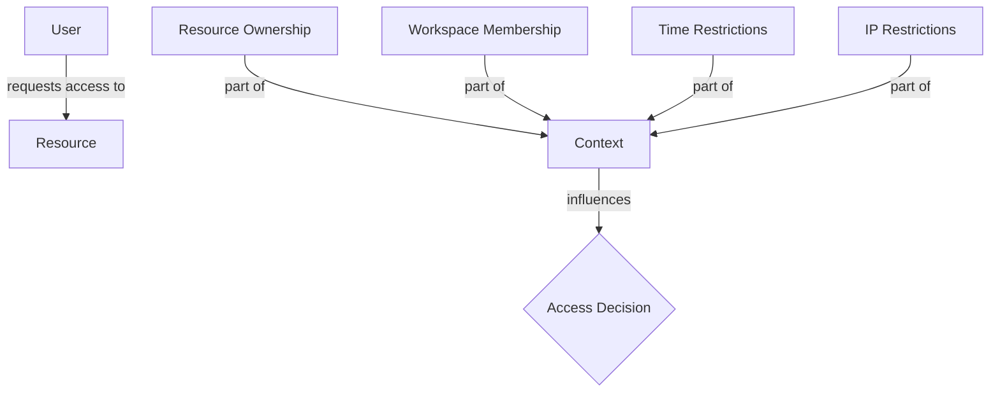

# Authorization System

CodeDefender implements a sophisticated, multi-layered authorization system that combines role-based access control, plan-based feature flags, and contextual access control.

## Authorization Components

### 1. Role-Based Access Control (RBAC)

Assigns permissions to roles, which are then assigned to users.



### 2. Plan-Based Feature Access

Controls feature availability based on subscription plans.



### 3. Contextual Access Control

Enforces access rules based on resource ownership, workspace membership, and other contextual factors.



## Permission Model

### Permissions Structure

Permissions follow a `RESOURCE:ACTION` pattern:

```typescript
// Permission definition
{
  code: "WORKSPACE:CREATE",
  name: "Create Workspace",
  description: "Ability to create new workspaces",
  scope: "GLOBAL",
  action: "CREATE",
  resource: "WORKSPACE"
}
```

### Permission Scopes

- **GLOBAL**: System-wide permissions
- **WORKSPACE**: Workspace-specific permissions
- **SCAN**: Scan-specific permissions
- **REPORT**: Report-specific permissions
- **USER**: User-specific permissions
- **REPOSITORY**: Repository-specific permissions
- **SCHEDULE**: Schedule-specific permissions

### Permission Actions

- **CREATE**: Create new resources
- **READ**: View resources
- **UPDATE**: Modify existing resources
- **DELETE**: Remove resources
- **EXECUTE**: Perform operations on resources
- **MANAGE**: Complete control over resources

## Role System

### System Roles

Global roles assigned at the user level:

- **SUPER**: System administrator with unrestricted access
- **SUPPORT**: Support staff with limited admin capabilities
- **OWNER**: Organization owner with organization-wide permissions
- **ADMIN**: Administrator with elevated permissions
- **MEMBER**: Regular user with basic permissions

### Workspace Roles

Roles assigned within specific workspaces:

- **ADMIN**: Workspace administrator
- **MEMBER**: Workspace member

### Custom Roles

User-defined roles with custom permission sets:

```typescript
// Custom role definition
{
  id: "c8e7f3a1-b2d9-4e5f-8a6b-7c9d0e1f2a3b",
  name: "Security Analyst",
  description: "Can view and run scans but not modify workspace settings",
  isDefault: false,
  permissions: [
    "SCAN:READ",
    "SCAN:EXECUTE",
    "REPORT:READ",
    "REPOSITORY:READ"
  ]
}
```

## Plan-Based Authorization

### Plan Tiers

- **STARTER**: Basic scanning capabilities
- **PRO**: Advanced scanning, API access, team features
- **BUSINESS**: Custom roles, SSO, audit logging
- **ENTERPRISE**: Priority support, unlimited resources

### Feature Flags

```typescript
// Feature availability by plan
export const PLAN_FEATURES: Record<Plan, PlanFeatures> = {
  [Plan.STARTER]: {
    hasAdvancedScan: false,
    hasHistoricalScan: false,
    hasScheduledScans: false,
    // ...other features
  },
  [Plan.PRO]: {
    hasAdvancedScan: true,
    hasHistoricalScan: true,
    hasScheduledScans: true,
    // ...other features
  },
  // ...other plans
};
```

### Usage Limits

```typescript
// Usage limits by plan
export const PLAN_LIMITS: Record<Plan, FeatureLimits> = {
  [Plan.STARTER]: {
    scansPerDay: 5,
    scansPerMonth: 30,
    usersPerWorkspace: 3,
    // ...other limits
  },
  [Plan.PRO]: {
    scansPerDay: 20,
    scansPerMonth: 200,
    usersPerWorkspace: 10,
    // ...other limits
  },
  // ...other plans
};
```

## Authorization Guards

### 1. Permission Guard

Enforces permission-based access control.

```typescript
@Injectable()
export class PermissionGuard implements CanActivate {
  constructor(
    private reflector: Reflector,
    private permissionsService: PermissionsService,
  ) {}

  async canActivate(context: ExecutionContext): Promise<boolean> {
    // Check if user has required permissions
  }
}
```

### 2. Feature Guard

Enforces plan-based feature access.

```typescript
@Injectable()
export class FeatureGuard implements CanActivate {
  constructor(
    private reflector: Reflector,
    private plansService: PlansService,
  ) {}

  async canActivate(context: ExecutionContext): Promise<boolean> {
    // Check if user's plan includes required features
  }
}
```

### 3. Limit Guard

Enforces usage limits based on plan.

```typescript
@Injectable()
export class LimitGuard implements CanActivate {
  constructor(
    private reflector: Reflector,
    private plansService: PlansService,
  ) {}

  async canActivate(context: ExecutionContext): Promise<boolean> {
    // Check if user is within their usage limits
  }
}
```

### 4. Context-Aware Guard

Enforces contextual access rules.

```typescript
@Injectable()
export class ContextAwareGuard implements CanActivate {
  constructor(
    private reflector: Reflector,
    private permissionsService: PermissionsService,
  ) {}

  async canActivate(context: ExecutionContext): Promise<boolean> {
    // Check contextual access rules
  }
}
```

### 5. Unified Auth Guard

Combines multiple authorization strategies.

```typescript
@Injectable()
export class UnifiedAuthGuard implements CanActivate {
  constructor(
    private reflector: Reflector,
    private permissionsService: PermissionsService,
    private plansService: PlansService,
  ) {}

  async canActivate(context: ExecutionContext): Promise<boolean> {
    // Apply multiple authorization strategies
  }
}
```

## Authorization Decorators

### Permission Decorators

```typescript
// Require permission
@RequiresPermission('SCAN:CREATE')
method() {}

// Require all permissions
@RequiresAllPermissions(['SCAN:CREATE', 'REPOSITORY:READ'])
method() {}

// Require any permission
@RequiresAnyPermission(['WORKSPACE:MANAGE', 'WORKSPACE:UPDATE'])
method() {}

// Require workspace permission
@RequiresWorkspacePermission('SCAN:CREATE')
method() {}
```

### Feature Decorators

```typescript
// Require feature
@RequiresFeature(Feature.ADVANCED_SCAN)
method() {}

// Require all features
@RequiresAllFeatures([Feature.ADVANCED_SCAN, Feature.HISTORICAL_SCAN])
method() {}

// Require any feature
@RequiresAnyFeature([Feature.SCHEDULED_SCANS, Feature.API_ACCESS])
method() {}

// Check usage limit
@CheckLimit(LimitType.SCANS_PER_DAY)
method() {}
```

### Unified Authorization

```typescript
// Combined authorization
@Authorize({
  permissions: ['SCAN:CREATE'],
  features: [Feature.ADVANCED_SCAN],
  limitType: LimitType.SCANS_PER_DAY,
  checkWorkspaceMembership: true,
})
method() {}

// Resource authorization
@AuthorizeResource(
  'SCAN',
  'scanId',
  ['SCAN:UPDATE'],
  [Feature.ADVANCED_SCAN]
)
method() {}

// Workspace authorization
@AuthorizeWorkspace(
  ['WORKSPACE:READ'],
  [Feature.TEAM_MANAGEMENT]
)
method() {}
```

## Usage Example

```typescript
@Controller('workspaces/:workspace_id/scans')
export class ScansController {
  @Post('advanced')
  @AuthorizeResource(
    'WORKSPACE',
    'workspace_id',
    [PERMISSION_CODES.SCAN_CREATE],
    [Feature.ADVANCED_SCAN]
  )
  @CheckLimit(LimitType.SCANS_PER_DAY)
  createAdvancedScan(
    @Param('workspace_id') workspaceId: string,
    @Body() createScanDto: CreateScanDto,
    @Request() req
  ) {
    // Implementation
  }
}
```