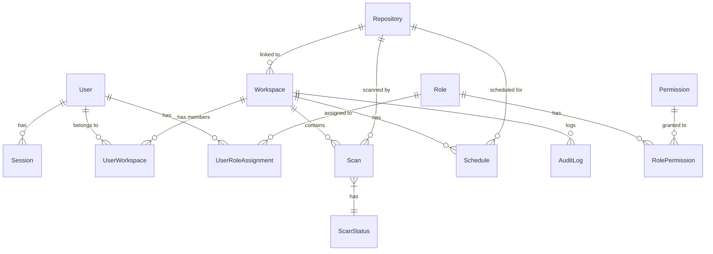

# Data Model

CodeDefender uses a relational database with PostgreSQL and Prisma ORM. This document outlines the core data model.

## Entity Relationship Diagram

The simplified entity relationship diagram shows key relationships between models:



## Core Models

### User

```typescript
model User {
  id                String            @id @default(uuid())
  email             String            @unique
  password          String?
  firstName         String?           @map("first_name")
  lastName          String?           @map("last_name")
  provider          String?
  providerId        String?           @map("provider_id")
  role              String            @default("MEMBER") @map("user_role")
  orgName           String?           @map("org_name")
  plan              Plan              @default(STARTER)
  ownerId           String?           @map("owner_id")
  
  // MFA fields
  mfaSecret         String?           @map("mfa_secret")
  mfaEnabled        Boolean           @default(false) @map("mfa_enabled")
  
  // Authentication & Session
  sessions          Session[]
  trustedDevices    TrustedDevice[]
  oauthProviders    OAuthProvider[]
  passwordlessTokens PasswordlessToken[]
  
  // Authorization & Resources
  workspaces        Workspace[]       @relation("WorkspaceOwner")
  userWorkspaces    UserWorkspace[]
  userRoleAssignments UserRoleAssignment[]
  
  // Audit & Usage
  usageLogs         UsageLog[]
  auditLogs         AuditLog[]
}
```

### Authorization Models

```typescript
model Permission {
  id                String            @id @default(uuid())
  code              String            @unique   // e.g., "SCAN:CREATE"
  name              String
  description       String?
  scope             String            // "GLOBAL", "WORKSPACE", "SCAN", "REPORT"
  action            String            // "CREATE", "READ", "UPDATE", "DELETE" 
  resource          String            // "SCAN", "REPORT", "WORKSPACE", etc.
  rolePermissions   RolePermission[]
}

model Role {
  id                String            @id @default(uuid())
  name              String            @unique  // "Viewer", "Editor", "Admin"
  description       String?
  isDefault         Boolean           @default(false) @map("is_default")
  rolePermissions   RolePermission[]
  userRoleAssignments UserRoleAssignment[]
}

model RolePermission {
  roleId            String            @map("role_id")
  permissionId      String            @map("permission_id")
  role              Role              @relation(fields: [roleId], references: [id], onDelete: Cascade)
  permission        Permission        @relation(fields: [permissionId], references: [id], onDelete: Cascade)
  @@id([roleId, permissionId])
}

model UserRoleAssignment {
  id                String            @id @default(uuid())
  userId            String            @map("user_id")
  roleId            String            @map("role_id")
  workspaceId       String?           @map("workspace_id")
  user              User              @relation(fields: [userId], references: [id], onDelete: Cascade)
  role              Role              @relation(fields: [roleId], references: [id], onDelete: Cascade)
  workspace         Workspace?        @relation(fields: [workspaceId], references: [id], onDelete: Cascade)
  @@unique([userId, roleId, workspaceId])
}
```

### Workspace and Repository Models

```typescript
model Workspace {
  id             String          @id @default(uuid())
  name           String
  ownerId        String          @map("owner_id")
  owner          User            @relation("WorkspaceOwner", fields: [ownerId], references: [id])
  repositoryId   String?         @map("repository_id")
  repository     Repository?     @relation(fields: [repositoryId], references: [id])
  userWorkspaces UserWorkspace[]
  userRoleAssignments UserRoleAssignment[]
  scans          Scan[]
  schedules      Schedule[]
  auditLogs      AuditLog[]
}

model UserWorkspace {
  id          String        @id @default(uuid())
  userId      String        @map("user_id")
  workspaceId String        @map("workspace_id")
  role        WorkspaceRole
  user        User          @relation(fields: [userId], references: [id], onDelete: Cascade)
  workspace   Workspace     @relation(fields: [workspaceId], references: [id], onDelete: Cascade)
  @@unique([userId, workspaceId])
}

model Repository {
  id          String             @id @default(uuid())
  url         String
  provider    RepositoryProvider
  accessToken String             @map("access_token")
  ownerId     String             @map("owner_id")
  workspaces  Workspace[]
  scans       Scan[]
  schedules   Schedule[]
}
```

### Scan and Schedule Models

```typescript
model Scan {
  id             String     @id @default(uuid())
  repositoryId   String     @map("repository_id")
  repository     Repository @relation(fields: [repositoryId], references: [id])
  workspaceId    String     @map("workspace_id")
  workspace      Workspace  @relation(fields: [workspaceId], references: [id])
  branch         String
  status         ScanStatus
  results        Json?
  historical     Boolean    @default(false)
  fileExclusions String[]   @map("file_exclusions")
  completedAt    DateTime?  @map("completed_at")
}

model Schedule {
  id             String     @id @default(uuid())
  repositoryId   String     @map("repository_id")
  repository     Repository @relation(fields: [repositoryId], references: [id])
  workspaceId    String     @map("workspace_id")
  workspace      Workspace  @relation(fields: [workspaceId], references: [id])
  branch         String
  cronExpression String
  historical     Boolean    @default(false)
  fileExclusions String[]   @map("file_exclusions")
  active         Boolean    @default(true)
}
```

### Authentication and Session Models

```typescript
model Session {
  id                String            @id @default(uuid())
  userId            String            @map("user_id")
  token             String            @unique // JWT ID
  ipAddress         String?           @map("ip_address")
  userAgent         String?           @map("user_agent")
  deviceFingerprint String?           @map("device_fingerprint")
  lastActive        DateTime          @default(now()) @map("last_active")
  expiresAt         DateTime          @map("expires_at")
  isRevoked         Boolean           @default(false) @map("is_revoked")
  user              User              @relation(fields: [userId], references: [id], onDelete: Cascade)
}

model TrustedDevice {
  id                String            @id @default(uuid())
  userId            String            @map("user_id")
  fingerprint       String
  name              String?
  ipAddress         String?           @map("ip_address")
  lastUsed          DateTime          @default(now()) @map("last_used")
  user              User              @relation(fields: [userId], references: [id], onDelete: Cascade)
  @@unique([userId, fingerprint])
}

model OAuthProvider {
  id                String            @id @default(uuid())
  userId            String            @map("user_id")
  provider          String            // "google", "github", etc.
  providerId        String            @map("provider_id") // ID from the provider
  user              User              @relation(fields: [userId], references: [id], onDelete: Cascade)
  @@unique([provider, providerId])
  @@unique([userId, provider])
}
```

### Audit and Usage Models

```typescript
model AuditLog {
  id          String     @id @default(uuid())
  userId      String     @map("user_id")
  user        User       @relation(fields: [userId], references: [id])
  workspaceId String?    @map("workspace_id")
  workspace   Workspace? @relation(fields: [workspaceId], references: [id])
  action      String
  details     Json
  timestamp   DateTime   @default(now())
}

model UsageLog {
  id                String            @id @default(uuid())
  userId            String            @map("user_id")
  resourceType      String            @map("resource_type") // "SCAN", "REPORT", etc.
  action            String            // "CREATE", "READ", etc.
  count             Int               @default(1)
  user              User              @relation(fields: [userId], references: [id], onDelete: Cascade)
}
```

## Enums

```typescript
enum UserRole {
  SUPER
  SUPPORT
  OWNER
  ADMIN
  MEMBER
}

enum RepositoryProvider {
  GITHUB
  GITLAB
  BITBUCKET
}

enum ScanStatus {
  QUEUED
  RUNNING
  COMPLETED
  FAILED
}

enum Plan {
  STARTER
  PRO
  BUSINESS
  ENTERPRISE
}

enum WorkspaceRole {
  ADMIN
  MEMBER
}
```

## Database Schema Evolution

Schema migrations are managed through Prisma Migrate:

1. Make changes to the Prisma schema
2. Generate migration files: `prisma migrate dev --name migration_name`
3. Apply migrations: `prisma migrate deploy` (production) or `prisma migrate dev` (development)

## Data Access Patterns

All database access is abstracted through service classes:

```typescript
@Injectable()
export class ScansService {
  constructor(private prisma: PrismaService) {}

  async create(data: CreateScanDto, userId: string): Promise<Scan> {
    return this.prisma.scan.create({
      data: {
        /* ... */
      },
    });
  }
}
```